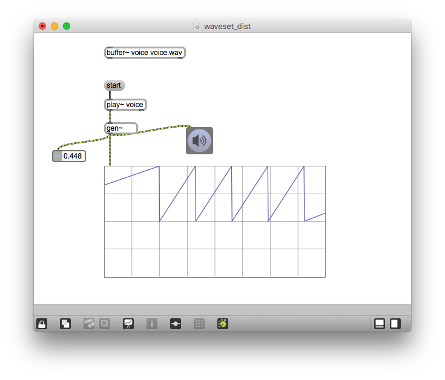
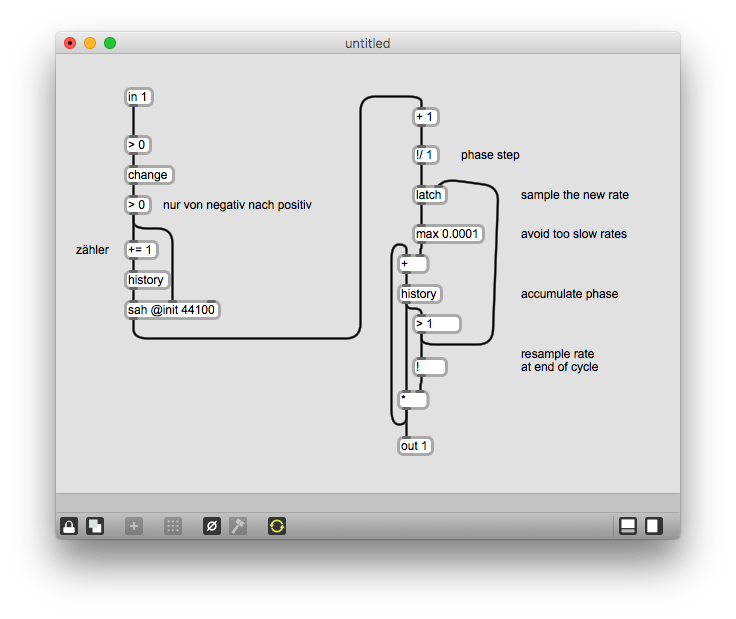

# Klasse10

## Modeltest #1

Programmieren Sie ein Patch, das Klangdatei "voice.wav" mit der Granularsynthese fünf mal länger als das Original ohne Tonhöheänderung abspielt. Sie müssen mit dem Sample-And-Hold und der OLA-Technik Klick-Noise vermeiden. (20 min.)

[voice.wav](Klasse10/voice.wav)

### Zero Crossing

zerox~ zählt "zero crossing".

### Noise-Erkennung

### zerox~ mit gen~

### Waveset Distortion

Trevor Wishart defined a waveset as the signal between two zerocrossings. For a simple sinusoid, this corresponds to the waveform. But for signals of richer harmonic content, it produces more complex artefacts.

#### Waveset-Erkennung

##### Erklärung

- > 0

- >
#### Waveset Distortion #1

#### Waveset Distortion #2

